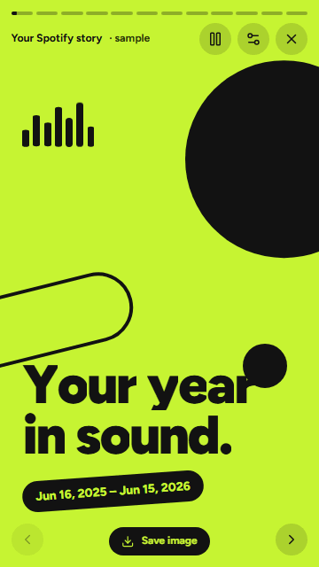
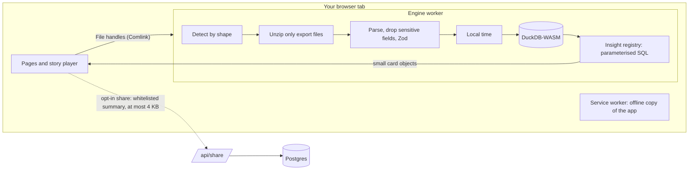

# Life, Wrapped

[](https://github.com/abdullahasghar966/life-wrapped/actions/workflows/ci.yml)

**Your Spotify, YouTube and Netflix data exports, turned into animated story decks, without your data ever leaving your device.**



- **Try it:** open `/story/spotify?sample=1` on any deployment for an instant story with sample data (one click from the landing page).
- **Deploy your own:** [](https://vercel.com/new/clone?repository-url=https%3A%2F%2Fgithub.com%2Fabdullahasghar966%2Flife-wrapped) (see [the deploy checklist](docs/DEPLOY.md)).

## Features

- **Four story decks, 41 cards.** Music, videos, shows, and all of it together. Each deck looks and moves like the app it's about, with no logos:
  - Spotify-style: bold duotones and bouncy motion
  - YouTube-style: player chrome and a scrubber
  - Netflix-style: cinematic glows, posters and credits
  - The app's own aurora theme for the combined deck
- **Your real exports.** Drop zips, folders or single files:
  - Spotify Extended streaming history (old and new formats) or Account data
  - Google Takeout YouTube history (in any language)
  - Netflix viewing activity, with a profile picker
- **Honest numbers.** YouTube watch time is estimated from the gaps between videos and always marked "≈" with an explanation. Cards without enough data are hidden, never shown empty.
- **A real story player.** Tap, hold to pause, swipe down to close, keyboard shortcuts, auto-advance, and a screen-reader announcement for every card.
- **Reduced motion.** Fully supported: no movement, numbers at their final value.
- **Save or share.** Any card exports as a 1080 × 1920 PNG, made in the browser. Summary cards can be shared as a link, after you've seen the exact JSON that will be uploaded, and deleted at any time.
- **Works offline.** After the first visit, turn off your Wi-Fi: adding files and playing stories still work.

## Verify the privacy claim yourself

1. Open the site, then your browser's developer tools (F12) → **Network**, and tick **Preserve log**.
2. Load your files (or the sample) and play every story. Every request goes to the site itself (pages, scripts, fonts, the DuckDB engine); none carries your data.
3. In the **Console**, run `fetch('https://example.com', { method: 'POST', body: 'x' })`. The Content Security Policy blocks it: `connect-src 'self'` only lets the page talk to its own origin.
4. Turn your Wi-Fi off. It keeps working.

The same checks run in CI on every push ([`privacy.spec.ts`](tests/e2e/privacy.spec.ts), [`offline.spec.ts`](tests/e2e/offline.spec.ts)). They ingest real-format exports and the sample, play all four decks, and fail on any request to another origin or any request with a body. [docs/PRIVACY.md](docs/PRIVACY.md) lists exactly what is read, what is dropped, and what sharing sends.

## How it works



Details: [docs/ARCHITECTURE.md](docs/ARCHITECTURE.md) · decisions: [docs/DECISIONS.md](docs/DECISIONS.md) (35 ADRs).

## Tech stack

| Choice                                         | Why                                                                                                                                       |
| ---------------------------------------------- | ----------------------------------------------------------------------------------------------------------------------------------------- |
| **Next.js 16** (App Router, Turbopack)         | Static pages for a fast, offline-capable shell, plus one server route for optional sharing.                                               |
| **DuckDB-WASM** in a Web Worker (Comlink)      | Real SQL over hundreds of thousands of rows in the browser, without blocking the UI.                                                      |
| **TypeScript strict** + **Zod**                | Exports change shape without notice; every row is validated and unknown fields are dropped.                                               |
| **Tailwind v4** + CSS variables, **shadcn/ui** | Each theme is a typed token object applied as variables; app UI from accessible primitives.                                               |
| **GSAP** + `@gsap/react`                       | One timeline per card that pauses, resumes and cleans up with the player.                                                                 |
| **Hand-written SVG charts**                    | Exactly the shapes each theme needs, as real DOM text for screen readers.                                                                 |
| **Serwist**                                    | Precaches the app, fonts and DuckDB so it works offline.                                                                                  |
| **Drizzle** + **Neon** (PGlite in tests)       | The only server state: optional share cards, holding a whitelist of numbers and names.                                                    |
| **Vitest** + **Playwright** + **axe**          | Unit tests against DuckDB in Node; E2E against the production build, with privacy, offline, accessibility, visual and performance checks. |

## Engineering highlights

- **DuckDB in a worker, behind one interface.**
  - The engine (`src/engine/api.ts`) takes a `createDb`: the browser gets DuckDB-WASM in a nested worker, while unit tests run the same SQL against DuckDB in Node.
  - Rows arrive as Arrow IPC, built straight into Arrow buffers. There's no `new Function`, so the CSP needs no `'unsafe-eval'`.
  - 500k real-format rows ingest in about 7 s.
- **The YouTube estimator.** Takeout records when a video was opened, not for how long. A watch counts as the gap to the next one, up to 30 minutes (8 minutes otherwise). Runs of short gaps become "rabbit holes" (ADR-004).
- **Shape-based detection.** Files are recognised by the keys in their rows, not their names, so localised Takeout exports (`historial-de-reproducciones.json`) work. Inside zips, only export files are even decompressed.
- **The theme system.**
  - Typed tokens → CSS variables, with every text/background pair contrast-tested.
  - Cards are sized in container-query units, so one layout serves phones, desktop and the 1080 × 1920 export.
  - Each theme has its own type, motion, progress chrome and card transition, and generated artwork in place of real covers.
- **The privacy proof.**
  - A Playwright test records every request from the page and its workers while real data is processed.
  - Another proves the CSP blocks exfiltration.
  - The share-card preview image is drawn only with bundled fonts, because `next/og` would otherwise fetch fallback fonts from Google with your text in the URL (ADR-033).
- **Offline with real data.**
  - Next.js turns a failed navigation into a full page load, which would wipe the tab's data, so the service worker saves each page's RSC payload and answers offline navigations with it.
  - Deck-to-deck moves use `history.pushState` (ADR-034).

## Performance

Measured on the production build (`pnpm build && pnpm start`):

| Budget (§15)                                                                                | Result                                                        |
| ------------------------------------------------------------------------------------------- | ------------------------------------------------------------- |
| Landing JS before interaction ≤ 150 KB gzipped                                              | **145 KB** (no DuckDB, GSAP or player code)                   |
| Lighthouse mobile (median of 3): Performance ≥ 90 · Accessibility 100 · Best Practices ≥ 95 | **96 · 100 · 100** (SEO 100)                                  |
| LCP < 2 s on simulated 4G                                                                   | **2.8 s** (FCP 1.1 s, TBT 12 ms, CLS 0). Not met; see ADR-035 |
| Sample generated and loaded < 3 s                                                           | **1.1 s** in Node, **1.4 s** in the browser                   |
| 500k rows end to end < 10 s                                                                 | **7.2 s**                                                     |
| Landing → first story card                                                                  | **3.5–4.0 s**, including booting DuckDB (budget 5 s)          |

Budgets are enforced by `tests/perf/budgets.test.ts` and `tests/e2e/perf.spec.ts`. Run `pnpm lighthouse http://localhost:3000/` against a running build to measure Lighthouse yourself. The demo GIF above is recorded from the sample story by `pnpm demo:gif http://localhost:3000`.

## Local setup

```bash
pnpm install
pnpm dev
```

Then open <http://localhost:3000>. `pnpm install` copies the self-hosted DuckDB-WASM bundle into `public/duckdb/`. Sharing is optional: copy `.env.example` to `.env.local` and fill it in (see [docs/DEPLOY.md](docs/DEPLOY.md)).

## Tests

```bash
pnpm typecheck && pnpm lint && pnpm test   # unit tests, plus the serial performance budgets
pnpm build && pnpm e2e                     # Playwright against the production build
```

**Unit tests (Vitest)**

- Every parser, against real-format fixtures (old and new Spotify formats, localised YouTube, multi-profile Netflix)
- Time zones and DST, and the YouTube estimator
- Every insight, snapshotted against the seeded sample
- Theme contrast, the share whitelist, and the preview images

**E2E tests (Playwright, against the production build)**

- Every deck played to the end
- Fixture uploads and settings
- The share flow, against an in-memory Postgres
- The privacy and offline tests
- axe on every card and app page
- Visual snapshots of every card
- The performance budgets

## Roadmap

- More sources: Apple Music, Prime Video, Twitch.
- A year-over-year view for people with several years of history.
- Optional local persistence (an explicit "remember on this device" switch, stored encrypted in the browser).

---

_Life, Wrapped is an independent project and is not affiliated with or endorsed by Spotify, YouTube/Google or Netflix. Themes are inspired by those apps' styles; no logos, artwork, brand fonts or sounds are used._
