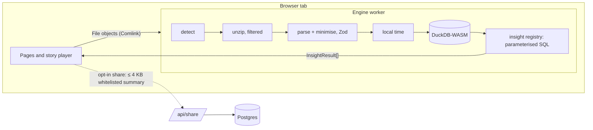
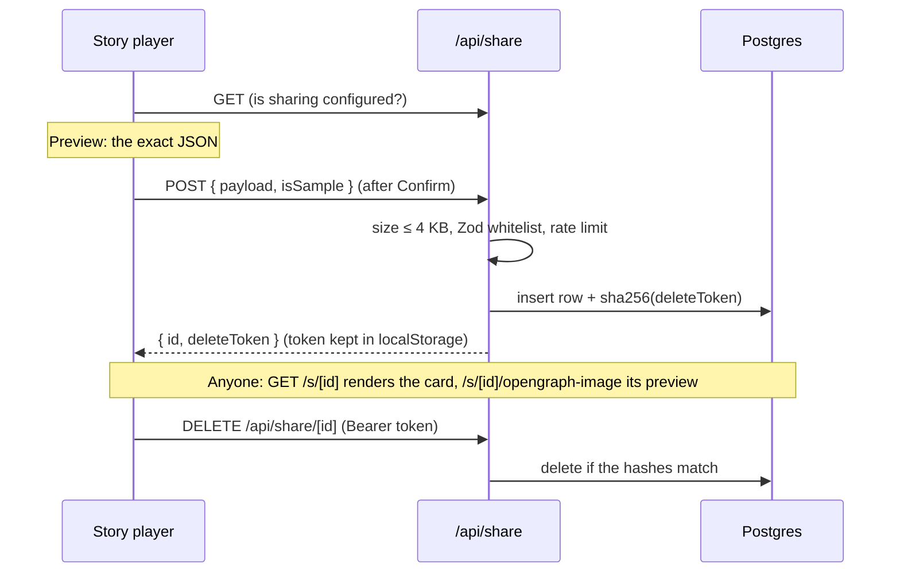

# Architecture

Everything that touches personal data runs in one Web Worker in the user's tab. The page only ever receives small, pre-computed card objects.



## Data flow

1. **Input.** Files, folders (`webkitGetAsEntry`) or zips go to the worker as `File` handles (`src/lib/files.ts`).
2. **Unzip.** `src/engine/ingest/unzip.ts` streams the zip with fflate and inflates only entries that look like exports (`isInterestingZipEntry`).
3. **Detect.** `detect.ts` identifies each file by the shape of its rows (keys present), then by name. Localised names still work.
4. **Parse.** One Zod-validated parser per format (`spotify.ts`, `youtube.ts`, `netflix.ts`). Sensitive fields are deleted first (`minimise.ts`) and Zod strips anything unknown. Rows are de-duplicated by natural key; identical files by SHA-256.
5. **Time.** `time.ts` converts UTC to the user's time zone with an offset cached per UTC hour.
6. **Load.** `db/load.ts` builds Arrow columns and inserts them through staging tables. The YouTube estimator (`youtubeEstimate.ts`) adds `est_seconds` and `session_id` at this point.
7. **Insights.** `getDeck(deck)` runs every insight of that deck against DuckDB and returns `InsightResult[]`.

The parsed, minimised UTC rows stay in worker memory, so changing the time zone rebuilds the tables without re-reading files.

## Worker API

`src/engine/api.ts` exports `createEngine({ createDb, now })`. It doesn't know whether it runs in a worker or in Node:

| Method                                                                                      | What it does                                                                   |
| ------------------------------------------------------------------------------------------- | ------------------------------------------------------------------------------ |
| `ingest(files, { timeZone }, onProgress)`                                                   | Adds files to the dataset, rebuilds tables, returns an `IngestSummary`         |
| `cancelIngest()`                                                                            | Stops between files or zip chunks                                              |
| `loadSample(seed?, { timeZone })`                                                           | Generates Alex's exports in raw formats and ingests them normally              |
| `setOptions({ timeZone, period, includePrivateSessions, includeSearches, netflixProfile })` | Changes filters; only a time-zone change reloads tables                        |
| `summary()` / `availableDecks()`                                                            | What was found and which decks have enough data                                |
| `getDeck(deck)`                                                                             | The deck's cards (cached until options change)                                 |
| `topMedia()`                                                                                | Top songs and videos to play alongside, with checked ids; empty for the sample |
| `clear()`                                                                                   | Drops everything                                                               |

`worker.ts` wraps it with Comlink; `src/lib/engineStore.ts` is the UI-side store (`useSyncExternalStore`). Tests call the same engine with DuckDB's Node build (`tests/helpers/engine.ts`).

## Insight registry

Each insight is one file under `src/engine/insights/<deck>/` exporting an `InsightDef`:

```ts
{ id, deck, order, title,
  requires(q, ctx) → boolean,   // minimum-data rule; false hides the card
  run(q, ctx) → props | null,   // parameterised SQL only
  a11yText(props) → string,     // one sentence for screen readers
  share?(props) → SharePayload } // summary cards only
```

- `DataCtx` carries the period, time zone, selected Netflix profile, the private-session and search switches, the first data date per platform and which platform decks are available.
- Shared SQL fragments (`filters.ts`) apply the period, profile and private-session rules in one place. Values always travel as parameters.
- Every threshold lives in `constants.ts` with a comment saying why.
- `registry.ts` runs a deck in order, skipping cards whose `requires` fails, and attaches a stable `seed` (hash of the props) that card components use to pick copy variants.
- Results leave SQL as `DOUBLE`/`VARCHAR` only, so they're plain JSON.

Tests: `tests/unit/insights.sample.test.ts` snapshots every insight against the seeded sample; `insights.rules.test.ts` checks the minimum-data, privacy and period rules on small hand-built datasets.

## Story player

`src/story/Player.tsx` plays one deck. Each card is a `Slide` (`role="group"`, `aria-roledescription="slide"`, `aria-label="3 of 12: Top artist"`) wrapping a card component from `src/story/cards/`, looked up by insight id in `cards/index.ts`.

- **Navigation:** `gestures.ts` (tap left third / right two thirds, hold to pause, swipe down to close), arrow keys, Space, Esc, and visible buttons for all of them.
- **Timing:** one GSAP tween per card drives auto-advance (7 s) and the progress chrome; summary cards don't auto-advance. Holding, the pause button, the settings sheet and a hidden tab all pause it.
- **Motion:** each card builds one GSAP timeline with `useCardAnim`, registered with a `CardController` so pause/resume reaches every animation; `useGSAP` cleans up on unmount. Reduced motion builds no timelines at all, so the DOM already shows the final state; count-ups keep the real number in screen-reader text from the start.
- **Announcements:** an `aria-live="polite"` region reads the card's `a11yText` on every change.
- **Export:** `ExportStage` re-renders the current card off-screen at 1080 × 1920 with motion off and captures it with `html-to-image`, for Save image and for the share sheet.
- **Chaining:** the last card links to the next available deck; the Life deck plays last. The story page fetches the next deck while the current one plays, and the frame turns into it like a cube (`depth.ts`, ADR-039).
- **Shell:** the player's root wears the app's receipt brand. Only the frame carries the deck's theme variables and background, so the page around the story stays the same from deck to deck (ADR-038).
- **3D:** `src/story/depth.ts` holds the 3D moves (the deck cube, hinges, flips, carousels, credits, a stamp). They're CSS 3D transforms driven by GSAP. Cards only animate _from_ a 3D pose to their flat final state, so reduced motion and saved images are unaffected.

## Playing a song or video

`src/media/` (ADR-040). The story page asks the worker for `topMedia()` (own data only). `MediaPicker` pops up once per tab as the Spotify or YouTube story starts, and the music button in the player's controls opens it again. `MediaDock` frames the chosen track or video in the platform's own player:

- the player URL comes from `embed.ts`, which checks the id again;
- the frame is sandboxed, without top navigation;
- the CSP's `frame-src` lists only the two player origins.

The dock lives outside the Player, so it keeps playing through loading screens and from one deck to the next.

## Sharing

Every card's **Share** button opens `ShareSheet.tsx`. The player renders the card's PNG with `ExportStage`, and the sheet shows it with two ways to share:

- **The image**, through the device's share sheet (`nativeShare.ts`, the Web Share API). Nothing goes to a server, and there are no platform logins (ADR-037). Browsers without file sharing get Save image.
- **A link**, on summary cards only: the server feature below.

### Share links

The only server feature. It is opt-in per card, and works only when `DATABASE_URL` and `SHARE_SALT` are set.



- **Whitelist:** `src/share/schema.ts` lists, per summary card type, the numbers and names that may be shared. The client builds the request with it (`buildShareRequest`), so the preview is exactly what the server will accept.
- **Client:** the link part of `ShareSheet.tsx` (check → preview → confirm → link, which can then go to the share sheet) and `tokens.ts` (delete tokens in `localStorage`).
- **API:** `src/app/api/share/route.ts` (GET status, POST create) and `src/app/api/share/[id]/route.ts` (DELETE).
- **Server modules:** in `src/server/`:
  - `db.ts`: Neon over HTTP, or PGlite for `pglite://` URLs in tests
  - `schema.ts`: the Drizzle tables; migrations live in `drizzle/`
  - `shares.ts`: create, read and delete
  - `rateLimit.ts`: 10 an hour, keyed by `sha256(ip + salt)`
- **Shared page:** `src/app/s/[id]/page.tsx` loads and re-validates the row. `src/share/cards.ts` rebuilds the card's props, and `SharedCard.tsx` renders the summary component (`cards/summaries.ts`) in its still frame. `DeleteShare.tsx` shows Delete only in the browser that holds the token, and `ShareLinkButton.tsx` passes the page's link to the share sheet or copies it.
- **Preview images:** `src/share/og.tsx` draws themed 1200 × 630 images with `next/og`, using only the fonts in `assets/fonts/` (ADR-033). The routes are `src/app/s/[id]/opengraph-image.tsx` and `src/app/opengraph-image.tsx`.

## Offline

`src/sw/sw.ts` is the service worker (Serwist). `src/app/serwist/[path]/route.ts` bundles it with esbuild at build time and serves it at `/serwist/sw.js`. `src/components/ServiceWorker.tsx` registers it in production, once the page is loaded and idle (ADR-034).

- **Precache:** this build's `/_next/static` files (scripts, styles, `woff2` fonts), everything in `public/` (DuckDB's worker and WASM, icons), the manifest and the pages listed in `src/sw/routes.ts`. `tests/unit/offline.test.ts` checks that list covers every static page and deck.
- **Page loads:** the app's own pages come from the precache whatever their query string. Other pages come from the network, or `/offline` when there is none.
- **Client navigation:** RSC requests go to the network first; when that fails, the payload saved at install answers, so Next.js never falls back to a page load that would lose the tab's data. Deck-to-deck moves use `history.pushState` and need nothing at all.
- **Workers:** worker scripts are served as fresh responses so the engine worker keeps the bootstrap config Turbopack puts in its URL fragment.

## Theme system

Each theme is a typed token object (`src/story/themes/{sound,watch,binge,receipt}.ts`): colours, a list of card backdrops (background + ink + muted + accent), fonts, radii and motion settings.

- `themeStyle(theme)` turns tokens into CSS variables (`--t-*`) next to `data-theme`: the receipt theme on the player root, the deck's theme on the story frame. `backdropStyle(backdrop)` sets the per-card `--c-*` variables. Cards read colours only through these variables.
- Fonts are self-hosted through `next/font`: Google fonts are downloaded at build time, and Archivo (the display face of the app's own brand) is a local file in `src/fonts/`. Only the app-shell fonts are preloaded.
- Theme-specific motion lives in `transitions.ts` (card-to-card), in each theme's `motion` tokens (eases, durations, staggers) and in the progress chrome (`progress/Progress.tsx`).
- `tests/unit/themes.test.ts` checks every declared text/background pair against WCAG AA.
- Generated artwork (`src/story/art/`) turns a name into a palette, pattern and initials, so covers, thumbnails, posters and avatars are deterministic and never fetched.
