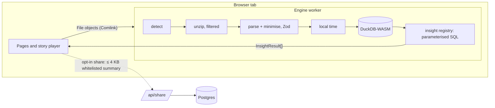

# Architecture

Everything that touches personal data runs in one Web Worker in the user's tab. The page only ever receives small, pre-computed card objects.



## Data flow

1. **Input.** Files, folders (`webkitGetAsEntry`) or zips go to the worker as `File` handles (`src/lib/files.ts`).
2. **Unzip.** `src/engine/ingest/unzip.ts` streams the zip with fflate and inflates only entries that look like exports (`isInterestingZipEntry`).
3. **Detect.** `detect.ts` identifies each file by the shape of its rows (keys present), then by name. Localised names still work.
4. **Parse.** One Zod-validated parser per format (`spotify.ts`, `youtube.ts`, `netflix.ts`). Sensitive fields are deleted first (`minimise.ts`) and Zod strips anything unknown. Rows are de-duplicated by natural key; identical files by SHA-256.
5. **Time.** `time.ts` converts UTC to the user's time zone with an offset cached per UTC hour.
6. **Load.** `db/load.ts` builds Arrow columns and inserts them through staging tables. The YouTube estimator (`youtubeEstimate.ts`) adds `est_seconds` and `session_id` at this point.
7. **Insights.** `getDeck(deck)` runs every insight of that deck against DuckDB and returns `InsightResult[]`.

The parsed, minimised UTC rows stay in worker memory, so changing the time zone rebuilds the tables without re-reading files.

## Worker API

`src/engine/api.ts` exports `createEngine({ createDb, now })`. It doesn't know whether it runs in a worker or in Node:

| Method                                                                                      | What it does                                                           |
| ------------------------------------------------------------------------------------------- | ---------------------------------------------------------------------- |
| `ingest(files, { timeZone }, onProgress)`                                                   | Adds files to the dataset, rebuilds tables, returns an `IngestSummary` |
| `cancelIngest()`                                                                            | Stops between files or zip chunks                                      |
| `loadSample(seed?, { timeZone })`                                                           | Generates Alex's exports in raw formats and ingests them normally      |
| `setOptions({ timeZone, period, includePrivateSessions, includeSearches, netflixProfile })` | Changes filters; only a time-zone change reloads tables                |
| `summary()` / `availableDecks()`                                                            | What was found and which decks have enough data                        |
| `getDeck(deck)`                                                                             | The deck's cards (cached until options change)                         |
| `clear()`                                                                                   | Drops everything                                                       |

`worker.ts` wraps it with Comlink; `src/lib/engineStore.ts` is the UI-side store (`useSyncExternalStore`). Tests call the same engine with DuckDB's Node build (`tests/helpers/engine.ts`).

## Insight registry

Each insight is one file under `src/engine/insights/<deck>/` exporting an `InsightDef`:

```ts
{ id, deck, order, title,
  requires(q, ctx) → boolean,   // minimum-data rule; false hides the card
  run(q, ctx) → props | null,   // parameterised SQL only
  a11yText(props) → string,     // one sentence for screen readers
  share?(props) → SharePayload } // summary cards only
```

- `DataCtx` carries the period, time zone, selected Netflix profile, the private-session and search switches, the first data date per platform and which platform decks are available.
- Shared SQL fragments (`filters.ts`) apply the period, profile and private-session rules in one place. Values always travel as parameters.
- Every threshold lives in `constants.ts` with a comment saying why.
- `registry.ts` runs a deck in order, skipping cards whose `requires` fails, and attaches a stable `seed` (hash of the props) that card components use to pick copy variants.
- Results leave SQL as `DOUBLE`/`VARCHAR` only, so they're plain JSON.

Tests: `tests/unit/insights.sample.test.ts` snapshots every insight against the seeded sample; `insights.rules.test.ts` checks the minimum-data, privacy and period rules on small hand-built datasets.

## Story player

`src/story/Player.tsx` plays one deck. Each card is a `Slide` (`role="group"`, `aria-roledescription="slide"`, `aria-label="3 of 12: Top artist"`) wrapping a card component from `src/story/cards/`, looked up by insight id in `cards/index.ts`.

- **Navigation:** `gestures.ts` (tap left third / right two thirds, hold to pause, swipe down to close), arrow keys, Space, Esc, and visible buttons for all of them.
- **Timing:** one GSAP tween per card drives auto-advance (7 s) and the progress chrome; summary cards don't auto-advance. Holding, the pause button, the settings sheet and a hidden tab all pause it.
- **Motion:** each card builds one GSAP timeline with `useCardAnim`, registered with a `CardController` so pause/resume reaches every animation; `useGSAP` cleans up on unmount. Reduced motion builds no timelines at all, so the DOM already shows the final state; count-ups keep the real number in screen-reader text from the start.
- **Announcements:** an `aria-live="polite"` region reads the card's `a11yText` on every change.
- **Export:** `ExportStage` re-renders the current card off-screen at 1080 × 1920 with motion off and captures it with `html-to-image`.
- **Chaining:** the last card links to the next available deck; the Life deck plays last.

## Theme system

Each theme is a typed token object (`src/story/themes/{sound,watch,binge,aurora}.ts`): colours, a list of card backdrops (background + ink + muted + accent), fonts, radii and motion settings.

- `themeStyle(theme)` turns tokens into CSS variables (`--t-*`) on the player root next to `data-theme`; `backdropStyle(backdrop)` sets the per-card `--c-*` variables. Cards read colours only through these variables.
- Fonts come from `next/font/google` (self-hosted at build time). Only the app-shell fonts are preloaded.
- Theme-specific motion lives in `transitions.ts` (card-to-card), in each theme's `motion` tokens (eases, durations, staggers) and in the progress chrome (`progress/Progress.tsx`).
- `tests/unit/themes.test.ts` checks every declared text/background pair against WCAG AA.
- Generated artwork (`src/story/art/`) turns a name into a palette, pattern and initials, so covers, thumbnails, posters and avatars are deterministic and never fetched.
